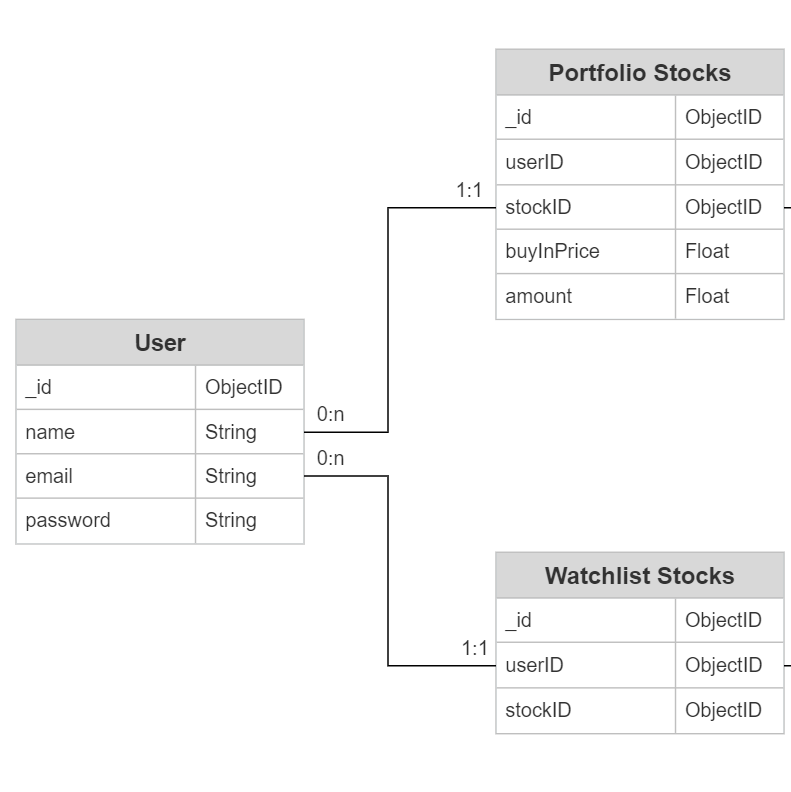

# Team 42 - Max Flow

## Application Name - StockExpert.io

## Team Overview

- Antonio Ruiz Fernandez [GitHub](https://github.com/antonioruiz2606)
- Zhiyang Zuo [GitHub](https://github.com/zzuo123)
- Xingyu Bian [GitHub](https://github.com/therealcyberlord)
- Aditya Maheshwari [GitHub](https://github.com/adityam789)

## Innovative Idea

We are planning on creating a website that allows users to track their stock portfolios and create a watchlist of stocks they're interested in and want to track/ monitor. It provides users with access to real-time market data, graphical representations of stock trends and historical data, as well as news articles related to the companies whose stocks are being traded and potentially set alerts.

We hope to make a comprehensive and user-friendly website that helps users make informed investment decisions and stay up-to-date with the latest news and trends in the stock market.

To do this, this platform will have a sentiment analysis model that scores the sentiment of stocks based on various factors such as news articles, social media trends, and market sentiment. This added feature makes the application unique and valuable because it enables users to make informed investment decisions by considering the sentiment surrounding the companies they are interested in.

This is similar to Yahoo Finance, but we are planning on adding more features and making it more user-friendly. We are also planning on using a sentiment analysis model to score the sentiment of stocks based on various factors such as news articles. This is an added feature to make the application unique and valuable because it enables users to make informed investment decisions by taking into account the sentiment surrounding the companies they are interested in.

## Database Schema

## Data

As with all special applications, this has a lot of data! Some of the important ones:

### Stock Data

- Description:
    This includes real-time and historical stock price data for various companies.
- Usage:
    It will be used to display stock prices, trends, and historical data on the website. The sentiment analysis model will also use this data to score the sentiment of the stocks based on various factors such as news articles and social media trends.
- Example:
    The stock data will include the name of the stocks, and the past and current price of the stocks.

### Portfolio Data

- Description:
    This includes data related to the user's portfolio, such as the stocks they own, the price they purchased the stocks at, the currentprice of the stocks.
- Usage:
    This data will be used to track the performance of the user's portfolio, display graphical representations of the portfolio's historicaldata, and set alerts for price changes.
- Example:
    The portfolio data will include the data on all of a user’s stocks, including the name, quantity, purchase price, and current value.

### Watchlist Data

- Description:
    This includes data related to the stocks that the user has added to their watchlist, similar to stock data.
- Usage:
    This data will be used to notify the user when there are significant changes in the stock price or sentiment.
- Example:
    The watchlist data will be a list of stocks that the user added to watchlist that can be iterated through and checked for change insentiment and price.

### News data

- Description:
    This will be text summary for a stock from multiple finantial news resources, along with links to news related to the stock, to provideuser with accurate information.
- Usage:
    The news data will be linked to a stock. This data will be presented to the user when they are viewing each individual stock so they canmake informed decisions when investing.
- Example:
    The news data will include news links and text summary.

### User Data (Not included in the at least four :)

- Description:
    This includes user account data, such as their name, email, and password.
- Usage:
    This data will be used to authenticate users and provide them with access to their portfolio, watchlist, and other personalized features.
- Example:
    The user data will include user login information (if we are storing password, it will be a hashed string), and links to the portfolio,watchlist and other user related data.

## Functionality

The platform will also feature a summary of a user’s tracked stocks, generated using a large language model summarizing multiple articles on followed stocks.

We will use the Chat-GPT API to generate the stock sentiment analysis and the analytical stock summary from multiple sources. Here are the following functionalities: 
    

### Display stock data

Displays a graphical representation for both historical and real-time data, this gives the user a visual of stock movements.

### Alert system

 Users can set alerts for price changes. This can give them real-time updates if a change where to occur in a stock they are interested in.

### Sentiment analysis

 Generate sentiment analysis with the help of a machine learning model that takes in current trends. This provides the user with information to determine if a stock has a positive or negative sentiment.

### Track stocks in portfolio/watchlist

 Takes in user data and tracks the performance of stocks in the portfolio and the watchlist. This gives emphasis to stocks that the user is interested as opposed to showing everything.

### Authenticate users

 Users can register an account and add their portfolio/watchlist to their account. This reduces repetitive data entry and makes the user experience more convenient. Users can log back in after creating an account using their username and password.

## License

[MIT License](https://opensource.org/licenses/MIT)
