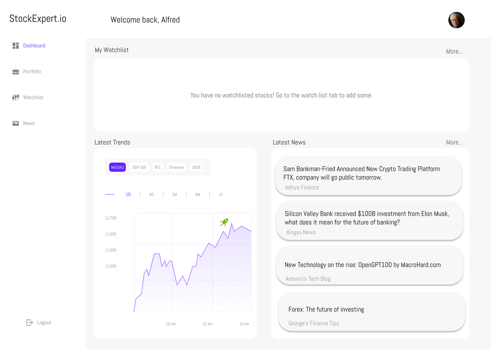

# UI Design

## Wireframe
[Wireframe (Figma)](https://www.figma.com/file/2hyG1R3kEAW8tf6Q1uomr7/StockExpert.io?node-id=0%3A1&t=wSkxmqcSjdW7cqb6-1)

### Login Screen
The first screen new StockExpert.io users will see is the login screen. They can add their credentials or be redirected to the registration screen.

### Register Screen
The register screen prompts users for their credentials. They will be asked to input their name, email, password, and to confirm their password.

### Dashboard
Once a user succesfully logs in, they will be greeted by the dashboard. Here they will see two of the main components of the site, the side and top bars. The side bar is for navigation between the pages, and the top bar is a greeting for the user.

The first item in the dashboard is a "watchlist summary", which features blobs of stocks that the user watchlisted (more on this on the watchlist page). The more button on the top right will redirect you to the watchlist page. Clicking on a stock will redirect you to that stock's stock view page.

Then there is a latest trends item, which features line chart of the price of major indexes and some currencies for the respective selected period.

And finally there are some blobs of latest world marked news. The more button will redirect you to the news page.

### Portfolio
In this page, users will be able to add and monitor stocks in the Add to Portfolio component. After this, they can see expanded stock blobs of their portfoio stocks. Each blob will include the stock's current price, the profit percentage, and the amount of shares the user owns.

Users can navigate this screen by scrolling on the stock blobs or searching for them in the search bar.

If a user clicks on one of their stocks they will be redirected to the stock view page.

### Watchlist
The watchlist is almost the same as the portfolio page, but it is meant to distinguish between investments and watchlisted assets. This way we can also let users see the percentage price increase of their investments and also allow them to keep an eye on different stocks.

### News
In the news site, users will find line graphs of major index prices (this might also be a horizontally scrollable menu to include more indexes and currencies). And then there is an expanded scrollable list of news articles that are related to a users watchlisted and portfolio stocks. This is just an accumulation of all the news articles presented in the stock view page for every stock that is watchlisted and in portfolio.

### Stock View Page
Whenever a user clicks on a stock, they will be presented with that stock's view page.

Users will see a line chart of the price of the selected stock, as well as how many shares they own and the percentage price increase if they have it in their portfolio.

Below that, there is the sentiment analysis summary done with our model. The sentiment score ranges from zero to one, zero being negative sentiment and one being positive.

Next, there is the stock expert review, which is the review of the stock done with the ChatGPT API by asking the model to summarize what is said about this stock from multiple sources and also cite the information.

Below this there are latest news blobs of news articles related to the stock.

## User Stories

### Alfred Signs up

Alfred is an investor that wants a faster way to learn about current events and opinions surrounding their investments, they find StockExpert.io. The investor is greeted with the login page, but he doesn't have an account, so he clicks on the register button. Once he enter their email and confirm their password, he are able to log in.

| Logging In  | Registering |
| ------------- | ------------- |
|   |   |

### Alfred's Dashboard

Alfred is greeted with the dashboard, where he will see prices of major indexes and currencies, as well as some news blocks of recent events that affect the world market. He want to see changes to NASDAQ in the last day, so he select NASDAQ in the major index price graph. The investor is interested in one specific article from Xingyu News regarding the purchase of SVB, so he click on the news block and he are redirected to the news article.

| Dashboard Activity  |
| ------------- |
|  |

### Alfred adds some stocks

The investor notices that he doesn't have any watchlisted stocks shown in the dashboard, so he clicks on the sidebar to add stocks to his portfolio and watchlist. Here, the investor uses the menu on the right to add stocks he wants to monitor, Apparently, Alfred really likes APPL (Apple), so he adds it multiple times to his portfolio and to his watchlist. Now he will be able to monitor Apple from the dashboard, watchlist, and portfolio screens.

| New Dashboard | Portfolio | Watchlist |
| ------------- | -------- | ---------
|  |  | 

### Alfred looks for news articles on his investments

Alfred now wants to read more about recent events surrounding his APPL investments. So he goes to the news tab, where he can also see major indexes and their prices in graphs like the dashboard. He also has a list of news articles that are related to his investments, in this case, Apple. He clicks on one of the news blocks and reads an article on Apple's manufacturing.

| Alfred's News |
| ------------- |
| 

### Alfred wants more

Alfred wants a deeper insight into what is going on with Apple, but from the start, he wanted to do this more efficiently. This is where StockExpert.io shines. Alfred clicks on his Apple stock and is redirected to the Apple Stock View page. Here, he can see the stock price. But below that, he has a sentiment analysis from a Hugging Face natural language processing model, indicating in a range from zero to one how positive the sentiment is around the Apple stock. The model processes multiple sources to get this value, the same relevant sources that appear in the bottom right corner of the page. To the right, there is the Stock Expert Review of the stock, which summarizes all of the sources below it with references in a concise and precise report on Alfred's investment.

Alfred can now learn more about Apple stock in just a few paragraphs with a smart synthesis of current events surrounding the stock. Instead of scavenging the web for each of his investments and reading multiple news articles with varying perspectives on his stock portfolio, he can now learn enough reading a simple summary. Now Alfred can make more informed decisions on his investments with a minimal time expense on research.

| APPL Stock View |
| --------------- |
| 

## References

- [Wireframe (Figma)](https://www.figma.com/file/2hyG1R3kEAW8tf6Q1uomr7/StockExpert.io?node-id=0%3A1&t=wSkxmqcSjdW7cqb6-1)

